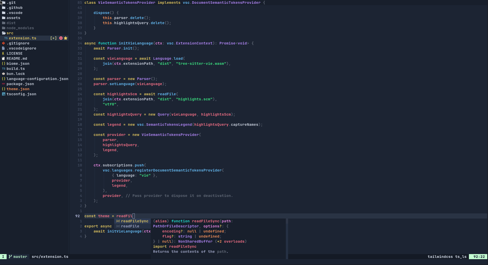

<p align="center">    
    <h2 align="center">Arc for Neovim</h2>
</p>

<p align="center">Neovim theme based on logic for increasing code reading speed.</p>

## Getting started

Install `nickshiro/arc.nvim` using your favourite package manager:

### [pam.nvim](https://github.com/mvllow/pam.nvim)

```lua
{ source = "nickshiro/arc.nvim", as = "arc" }
```

### [lazy.nvim](https://lazy.folke.io/installation)

**Structured Setup**

```lua
-- lua/plugins/arc_nvim.lua
return {
	"nickshiro/arc.nvim",
	name = "arc",
	config = function()
		vim.cmd("colorscheme arc")
	end
}
```

**Single file**

```lua
{ "nickshiro/arc.nvim", name = "arc" }
```

## Plugins

If a plugin is not listed, it does not necessarily mean that it is not supported.

[Indent Blankline](https://github.com/lukas-reineke/indent-blankline.nvim) 
[NeoTree](https://github.com/nvim-neo-tree/neo-tree.nvim)

## Galery



## Contributing

I'm welcome and appreciate contributions of any kind. Create an issue or start a discussion for any proposed changes. Pull requests are encouraged for supporting additional plugins or treesitter improvements.
